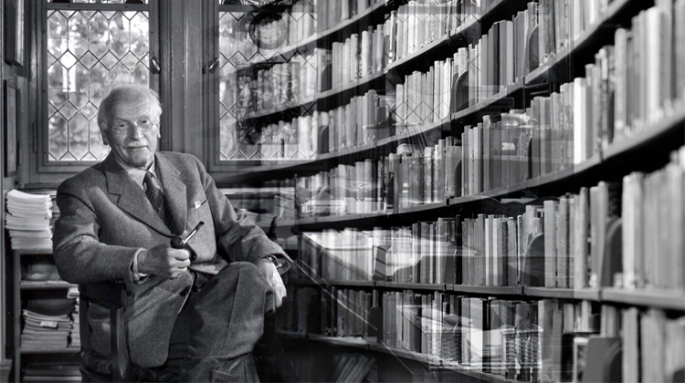

<!DOCTYPE html>
<html lang="en">
  <head>
    <meta charset="UTF-8" />
    <meta http-equiv="X-UA-Compatible" content="IE=edge" />
    <meta name="viewport" content="width=device-width, initial-scale=1.0" />
    <title>Tribute Page of Carl Jung</title>
    <link rel="stylesheet" href="./styles.css" />
  </head>
  <body>
    

      <main id="main">
        <h1 id="title">Carl Gustav Jung</h1>
        
Swiss psychologist

        <figure id="img-div">
          
          <figcaption id="img-caption">
            Carl Jung was the Swiss psychologist and psychiatrist who founded
            analytic psychology.  
            His work has been influential in psychiatry and in the study of
            religion, literature, and related fields.
          </figcaption>
        </figure>
        

          <h2>Here's a time line of Carl Jung's life:</h2>
          <ul>
            <li>
              1875 Jung was born in in Kesswill,
              Switzerland, son of a Reformed Protestant pastor, Johann Paul
              Jung, and Emilie Preiswerk.
            </li>
            <li>
              1895 Enters Basel University to study
              science and medicine.
            </li>
            <li>1896 Jung's father dies.</li>
            <li>
              1900 Jung graduates with a M.D. from the
              University of Basel and is appointed assistant at the Burgholzli
              Psychiatric Hospital, Zurich, under Professor Eugen Bleuler.
            </li>
            <li>
              1900-1909 Jung works at the Burgholzli
              Mental Hospital in Zurich.
            </li>
            <li>
              1902 Jung gets his Ph.D. at the
              University of Zurich with a doctoral dissertation On the
              Psychology and Pathology of So-Called Occult Phenomena.
            </li>
            <li>
              1903 Marries Emma Rauschenberg. The get
              five children in the course of time.
            </li>
            <li>
              1905-1913 Lectures on psychiatry at the
              University of Zurich.
            </li>
            <li>
              1906 Jung initiates letter
              correspondance with Sigmund Freud and visits him next year in
              Vienna.
            </li>
            <li>
              1907 First meeting with Freud. He writes
              The Psychology of Dementia Praecox.
            </li>
            <li>
              1909 Jung resigns from Burgholzli. He
              visits USA with Freud.
            </li>
            <li>
              1909
              Jung also opens his private practice of psychoanalysis in
              Kuessnacht - he runs it enthusiastically till he dies.
            </li>
            <li>
              1910 Jung is elected President of
              International Psychoanalytic Association. He writes Symbols of
              Transformation. Lectures at Fordham University.
            </li>
            <li>
              1912
              Jung declares he is scientifically independent of Freud and
              publishes Neue Bahnen der Psychologie.
            </li>
            <li>
              1913 Jung resigns as President. His
              final break with Freud.
            </li>
            <li>
              1917 Jung publishes Die Psychologie der
              unbewussten Prozesse.
            </li>
            <li>
              1919 Jung's first use of the term
              archetype (in Instinct und Unbewusstes).
            </li>
            <li>
              1921 Publishes Psychological Types.
            </li>
            <li>
              1923 Starts the building of his "tower"
              in Bollingen.
            </li>
            <li>
              1923 Jung visits Pueblo Indians in North
              America.
            </li>
            <li>
              1925 Study trip to the Elgonyi of Mount
              Elgon in East Africa.
            </li>
            <li>
              1929 Publishes his commentary on the
              Taoist text The Secret of the Golden Flower.
            </li>
            <li>
              1931 Publishes Seelenprobleme der
              Gegenwart.
            </li>
            <li>
              1932-1940 Jung works as a professor of
              psychology at the Federal Polytechnical University in Zurich.
            </li>
            <li>
              1934
              Publishes Wirklichkeit der Seele. He also begins a series of
              seminars on Nietzsche's Zarathustra. President (until 1939) of
              International Society for Medical Psychotherapy.
            </li>
            <li>
              1935 Tavistock Lectures, London, on
              "Analytical Psychology".
            </li>
            <li>
              1937 Jung's Terry Lectures, Yale
              University, on "Psychology and Religion".
            </li>
            <li>1937 Study trip to India.</li>
            <li>
              1941 Publishes Essays on a Science of
              Mythology with Karl Kerenyi.
            </li>
            <li>
              1944-1945 Jung becomes professor of
              medical psychology at the University of Basel, and his Psychology
              and Alchemy is published.
            </li>
            <li>
              1945 Publishes Nach der Katastrofe.
            </li>
            <li>
              1950 Publishes Aion - Researches into
              the Phenomenology of the Self.
            </li>
            <li>1951 Lecture "On Synchronicity".</li>
            <li>1952 Jung publishes Answer to Job</li>
            <li>
              1955? Publishes Mysterium Coniunctionis.
            </li>
            <li>
              1957 Jung publishes Gegenwart und
              Zukunft.
            </li>
            <li>
              1961 Jung dies at his home in Kusnacht,
              near Zurich, at the age of 85, after a short illness.
            </li>
            <li>
              1921 Publishes Psychological Types.
            </li>
          </ul>
        

        

          If you have time, you should read more about this incredible human
          being on
          <a
            href="https://www.britannica.com/biography/Carl-Jung"
            target="_blank"
            id="tribute-link"
            >Britannica</a
          >.
        

      </main>
    

  </body>
</html>
